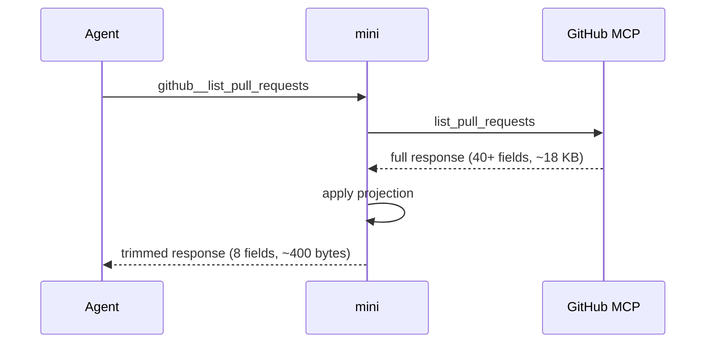
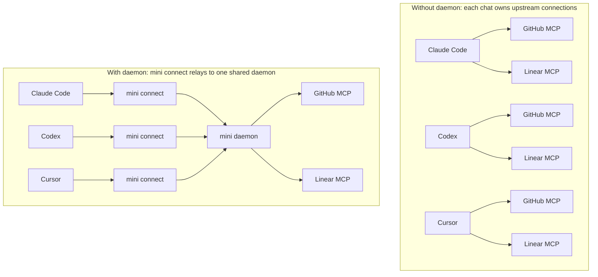

# mini

**mini** is an MCP proxy that sits between your AI agent and the tools it calls.

MCP servers are verbose — a GitHub `list_pull_requests` returns PR bodies, avatar URLs, node IDs, assignee objects, merge metadata, and dozens of URL template fields. Most of it your agent never reads. mini strips the noise so only what matters reaches context, saving tokens on every tool call.

> **New to MCP?** [Model Context Protocol](https://modelcontextprotocol.io) is how AI agents connect to external tools. mini sits in front of all of them.

## What it does

**Before** — `list_pull_requests` on `golang/go`, raw (`mini call -r`). The `body` alone is ~6,800 characters of benchmark tables, and every PR repeats the same `head`/`base`/`user` sub-objects:

```json
{
  "data": [
    {
      "number": 79998,
      "title": "internal/bytealg: optimize memequal",
      "body": "Implement vectorization optimization for small size memory comparing.\n\ngoos: linux\ngoarch: riscv64\n[~6,800 chars of benchmark tables]",
      "state": "open",
      "draft": false,
      "merged": false,
      "html_url": "https://github.com/golang/go/pull/79998",
      "user": { "login": "lxq015", "id": 79146446, "profile_url": "https://github.com/lxq015", "avatar_url": "https://avatars.githubusercontent.com/u/79146446?v=4" },
      "head": { "ref": "optimize_memequal", "sha": "bf5f9a21...", "repo": { "full_name": "lxq015/go", "description": "The Go programming language" } },
      "base": { "ref": "master", "sha": "dfc01c32...", "repo": { "full_name": "golang/go", "description": "The Go programming language" } },
      "created_at": "2026-06-13T07:39:36Z",
      "updated_at": "2026-06-13T08:10:43Z"
    },
    { "...": "9 more PRs, same shape" }
  ]
}
```

**After** — the same list through a projection that keeps just the fields you scan in a list view. Default JSON (`mini call -j`):

```json
{
  "data": [
    { "number": 79998, "state": "open", "draft": false, "title": "internal/bytealg: optimize memequal",
      "html_url": "https://github.com/golang/go/pull/79998" },
    { "number": 79997, "state": "open", "draft": false, "title": "internal/bytealg: optimize indexbyte_riscv64.s",
      "html_url": "https://github.com/golang/go/pull/79997" }
  ]
}
```

Or the **mini format** (`-m`) — field names once on a header row, values one line per item, no per-item key repetition. Most token-efficient for long lists:

```
[github.list_pull_requests]
draft html_url number state title
- https://github.com/golang/go/pull/79998 79998 open internal/bytealg: optimize memequal
- https://github.com/golang/go/pull/79997 79997 open internal/bytealg: optimize indexbyte_riscv64.s
```

You control exactly which fields survive — see [Projection config](#projection-config). `mini call -r` always returns the untouched upstream response when you need it.

## Install

```bash
go install github.com/mcpmini/mini/cmd/mini@latest
```

## Connect to your agent

Every client connects mini the same way — by running `mini connect`. Use `mini init` to import the MCP servers you already configured elsewhere:

```bash
mini init   # imports servers from Claude Code, Codex, Cursor, and more
```

Then register mini with your client:

```bash
# Claude Code
claude mcp add mini -- mini connect
```

Any other client: point its MCP config at `mini connect`:

```json
{
  "mcpServers": {
    "mini": { "command": "mini", "args": ["connect"] }
  }
}
```

`mini connect` re-exposes each upstream tool under a namespaced name (`github__list_pull_requests`, `sentry__list_issues`, etc.) and trims its response. mini isn't hidden — the tools are served by the `mini` MCP server, so your client lists them under `mini`, and the agent calls them through it.

## Adding servers

### Example: GitHub MCP

```bash
# Export a token first:
export GITHUB_TOKEN=...

# Add the server
mini add github \
  --url https://api.githubcopilot.com/mcp \
  --header "Authorization=Bearer $GITHUB_TOKEN"

# Check it connected
mini status

# Try a call
mini call github list_pull_requests '{"owner":"golang","repo":"go","perPage":5}'
```

Mini detects that GitHub is a known server and installs the bundled projection and tool-visibility defaults automatically.

### Other servers

```bash
mini add linear --url https://mcp.linear.app/mcp
mini add sentry --url https://mcp.sentry.io/mcp --header "Authorization=Bearer $SENTRY_TOKEN"
mini add slack  --url https://mcp.slack.com/mcp  --header "Authorization=Bearer $SLACK_TOKEN"
```

Import all servers from an existing agent config at once:

```bash
mini add --from-claude   # Claude Desktop / Claude Code
mini add --from-cursor   # Cursor mcp.json
mini add --from-codex    # Codex config.toml
mini add --from-gemini   # Gemini CLI settings.json
```

Bundled projection and tool-visibility defaults for known servers install automatically.

### Bundled server configs

These servers have projection and tool-visibility defaults built in — they're installed automatically when `mini add` or `mini init` detects a matching server name.

| Server | Projection config | Tools covered |
|---|---|---|
| GitHub | [github.yaml](internal/defaults/projections/github.yaml) | list_pull_requests, list_issues, get_issue, get_pull_request, list_commits, get_commit, search_code, search_repositories, search_issues, get_file_contents, list_repository_contents, list_pull_request_files |
| Slack | [slack.yaml](internal/defaults/projections/slack.yaml) | conversations_history, conversations_replies, conversations_list, search_messages, users_list |
| Linear | [linear.yaml](internal/defaults/projections/linear.yaml) | list_issues, search_issues, get_issue, create_issue, update_issue, list_projects, list_teams, list_cycles, list_comments |
| Sentry | [sentry.yaml](internal/defaults/projections/sentry.yaml) | list_issues, get_issue_details, list_events, list_projects, list_organizations |
| Atlassian | [atlassian.yaml](internal/defaults/projections/atlassian.yaml) | Jira: search, get_issue, get_project_issues, get_all_projects, get_project, get_agile_boards, get_sprint_issues — Confluence: search, get_page, get_page_children, get_comments |

For servers not in this list, mini is a transparent proxy — responses pass through unchanged until you add a projection config.

## How it works

Mini is a local process that runs on your machine and sits between your agent and your MCP servers. When your agent calls a tool, mini resolves which upstream server owns it, forwards the call, applies your projection config to the response (trimming fields, capping strings, stripping noise), then returns the result. The agent never connects to upstream servers directly.



mini re-exposes each upstream tool under a namespaced name (`github__list_pull_requests`, etc.) and serves it from its own MCP server, so in your client the tools appear under `mini` and every call goes through it. mini is the one resolving, forwarding, and trimming — the agent talks to mini, mini talks to the upstreams.

## Daemon mode

`mini connect` auto-detects a running daemon and routes through it, sharing one set of upstream connections across all agent sessions. If no daemon is running, `mini connect` starts one on demand. You usually do not need to manage it yourself; use `mini daemon status` to check whether it is running, or `mini daemon` to start it manually.



## Projection config

Projections are the rules that control what mini keeps, limits, or removes from responses. They live in `~/.mini/servers/<server>.proj.yaml` and are installed automatically for known servers by `mini init`.

For most users the bundled projections are enough. If you want to tune them:

```yaml
# ~/.mini/servers/github.proj.yaml

list_pull_requests:
  exclude: [avatar_url]   # strip provably-useless fields
  string_limits:
    body: 1500                   # cap at 1500 chars in list view

get_pull_request:
  string_limits:
    body: 8000                   # generous limit for detail view
```

The bar for exclusion is high — only strip fields that are **never** useful in any realistic agent workflow (URL template strings, image URLs, deprecated empty fields). When in doubt, keep the field. See [docs/default-config-philosophy.md](docs/default-config-philosophy.md) for full guidance.

Config directory layout:

```
~/.mini/
  config.yaml              # global settings (see below)
  servers/<name>.yaml      # one file per upstream server
  servers/<name>.proj.yaml # per-tool field rules
  internal/                # machine-managed runtime state
```

### Global config

`~/.mini/config.yaml` controls mini's overall behavior:

```yaml
log_level: info       # debug | info | warn | error
response_format: json # json (default) | mini (see above)
```

**`response_format: mini`** switches projected responses to the compact header:values format shown above — useful if your agent handles plain text better than structured data.

By default, mini caps strings at 2000 chars to keep responses manageable. You can raise, lower, or disable this with `default_string_limit` in `~/.mini/config.yaml` (set to `0` to disable). Projection configs can override the limit per field with `string_limits`.

### Recovering filtered data

mini always returns projected data inline. If projection removes or truncates anything, the response also includes `__mini.file` with a bare recovery key. The full upstream response is stored in `~/.mini/internal/responses/`; the agent can pass the key to `read`, optionally with a jq filter such as `.items[0].body`, to recover only the value it needs.

This happens only when projection actually removes data. Servers without projection rules remain transparent, and unchanged results have no `__mini` wrapper or recovery file.

**What the agent receives:**

- **Inline** — the projected JSON, same structure as the upstream response but with excluded fields and string limits applied. mini always inlines the projected result.
- **Raw file** — when fields are excluded or values are truncated, the full original response is written to `~/.mini/internal/responses/` and can be queried with `read`.

Response files are cleaned up automatically by TTL and disk budget.

## Auth

For servers that require OAuth2 (Linear, Slack):

```bash
mini auth linear   # opens browser to complete auth handshake
```

For servers using API keys or Bearer tokens, set them in the server config or reference an env var:

```yaml
# ~/.mini/servers/github.yaml
auth:
  type: bearer
  token: "${GITHUB_TOKEN}"
```

## Using mini from the CLI

You don't have to connect mini to an agent via MCP. `mini call` works as a standalone command — pipe it from scripts, use it in CI, or have your agent invoke it as a subprocess rather than connecting via MCP at all:

```bash
mini call github list_pull_requests '{"owner":"golang","repo":"go","perPage":3}'
mini call -m github list_issues '{"owner":"golang","repo":"go","state":"open","perPage":10}'
mini call -r github get_file_contents '{"owner":"golang","repo":"go","path":"README.md"}'
mini perm-call github create_pull_request '{"owner":"...","repo":"...","title":"..."}'
```

This is useful when:
- You want projection and auth handled for shell scripts or CI pipelines without an agent involved
- You're debugging what a tool actually returns before writing a projection config
- Your agent environment can run subprocesses but has limited MCP support

## Compact tool mode

Compact mode (`mini connect --tool-mode compact`) exposes exactly 4 tools regardless of how many upstream servers you have. It works similarly to `mini call`/`mini perm-call` from the CLI: the agent invokes tools through mini rather than directly:

| Tool | What it does |
|---|---|
| `list` | Discover tools across connected servers |
| `call` | Invoke an `open` tool; returns error for `protected` tools |
| `perm_call` | Invoke a `protected` tool — configure your client to always ask before running this |
| `config` | Add/remove servers, adjust projections, check status |

The `open`/`protected` split only matters in compact mode and the `mini call` / `mini perm-call` CLI. In the default proxy mode, upstream tools are exposed directly and approval is handled by your MCP client, not by mini. Use your client's native per-tool approval settings for writes. `hidden` tools are filtered from normal discovery, but that is visibility control, not a security boundary.

Use compact mode when your client loads every MCP tool schema eagerly at session start and a large catalog of servers is costing you context on every turn. Clients that defer schemas, like Claude Code, get no benefit from compact mode and lose native tool schemas, so stick with the default there. [How Claude Code loads MCP schemas →](docs/claude-code-mcp-loading.md)

## Commands

```
mini connect [--http ADDR] [--standalone] [--tool-mode proxy|compact]   Connect an agent (stdio MCP)
mini daemon                               Run as a shared background daemon
mini daemon status                        Check whether the daemon is running

mini ls                                   List configured servers
mini add NAME (--url URL | -- CMD [ARGS...])  Add a server
mini rm NAME                              Remove a server
mini status                               Server health and tool counts
mini test [--timeout T]                   CI health check (exits 1 on any failure)
mini auth NAME                            OAuth2 PKCE flow for a server
mini init [--yes]                         Setup wizard
mini cleanup                              Delete expired response files

mini call [-j|-m|-r] SERVER TOOL [JSON]   Invoke a tool directly
mini perm-call [-j|-m|-r] SERVER TOOL [JSON]  Invoke a protected tool directly
```
