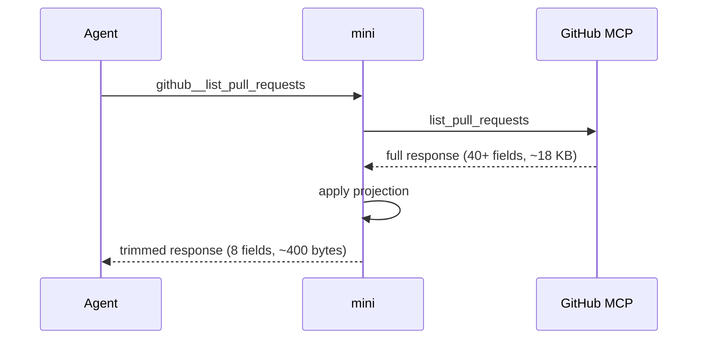
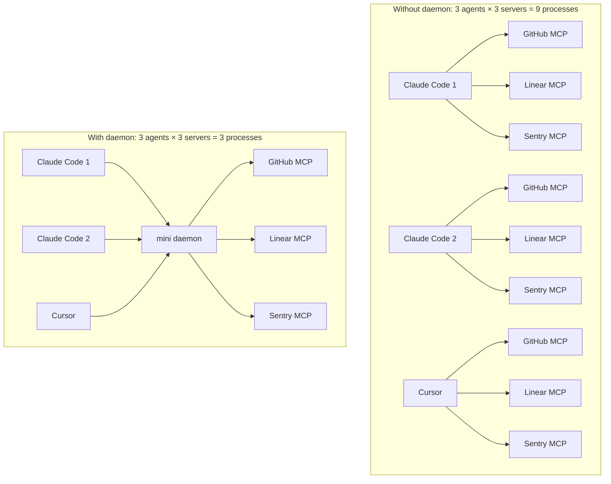

# mini

**mini** is an MCP proxy that sits between your AI agent and the tools it calls.

MCP servers are verbose — a GitHub `list_pull_requests` returns PR bodies, avatar URLs, node IDs, assignee objects, merge metadata, and dozens of URL template fields. Most of it your agent never reads. mini strips the noise so only what matters reaches context, saving tokens on every tool call.

> **New to MCP?** [Model Context Protocol](https://modelcontextprotocol.io) is how AI agents connect to external tools. mini sits in front of all of them.

## Install

```bash
go install github.com/mcpmini/mini/cmd/mini@latest
```

## Connect to your agent

### Claude Code

```bash
claude mcp add mini mini proxy
```

Mini runs in proxy mode for Claude Code, exposing your upstream tools directly as `github__list_pull_requests`, `sentry__list_issues`, etc. Claude Code only loads tool schemas it actually needs, so the full upstream surface doesn't bloat context. Responses are trimmed transparently.

[Why proxy mode and how Claude Code loads MCP schemas](docs/claude-code-mcp-loading.md)

### Codex

```bash
codex mcp add --name mini --command mini
```

Or add to `~/.codex/config.toml` manually:

```toml
[mcp_servers.mini]
command = "mini"
```

Codex loads all MCP tool schemas upfront, so the number of tools directly affects your token budget at session start. Mini's standard mode exposes exactly 4 tools regardless of how many upstream servers you have, keeping that cost fixed.

[How Codex loads MCP tools](docs/codex-mcp-loading.md)

### Cursor, Windsurf, Claude Desktop, Gemini

```bash
mini init   # detects your existing configs and adds mini automatically
```

Or add manually to your client's MCP config:

```json
{
  "mcpServers": {
    "mini": { "command": "mini" }
  }
}
```

Standard mode exposes 4 tools:

| Tool | What it does |
|---|---|
| `list` | Discover all tools across connected servers |
| `call` | Invoke a tool, response projected and returned |
| `perm_call` | Same as `call` but for protected tools (write ops) |
| `config` | Add/remove servers, adjust projections, check status |

### Daemon mode

If you run multiple agent sessions at once, each normally spawns its own mini process with its own upstream connections. Three Claude Code windows means three GitHub MCP processes, three Linear MCP processes, each consuming memory and holding its own auth session.

The daemon shares one set of upstream connections across all sessions:

```bash
mini daemon          # start once in the background
mini daemon status   # confirm it's running
```

Any `mini serve` or `mini proxy` invocation detects the daemon automatically and routes through it. Each session still gets its own projections and permissions.

## Adding servers

### Example: GitHub MCP

```bash
# Add the server
mini add github \
  --url https://api.githubcopilot.com/mcp \
  --header "Authorization=Bearer $GITHUB_PERSONAL_ACCESS_TOKEN"

# Check it connected
mini status

# Try a call
mini call github list_pull_requests '{"owner":"golang","repo":"go","perPage":5}'
```

Mini detects that GitHub is a known server and installs the bundled projection and permission configs automatically.

### Other servers

```bash
mini add linear --url https://mcp.linear.app/mcp
mini add sentry --url https://mcp.sentry.io/mcp --header "Authorization=Bearer $SENTRY_TOKEN"
mini add slack  --url https://mcp.slack.com/mcp  --header "Authorization=Bearer $SLACK_TOKEN"
```

Import all servers from an existing agent config at once:

```bash
mini add --from-claude   # Claude Desktop / Claude Code
mini add --from-cursor   # Cursor mcp.json
mini add --from-codex    # Codex config.toml
mini add --from-gemini   # Gemini CLI settings.json
```

Bundled projection and permission configs for known servers install automatically.

### Bundled server configs

These servers have projection and permission defaults built in — they're installed automatically when `mini add` or `mini init` detects a matching server name.

| Server | Projection config | Tools covered |
|---|---|---|
| GitHub | [github.yaml](internal/defaults/projections/github.yaml) | list_pull_requests, list_issues, get_issue, get_pull_request, list_commits, get_commit, search_code, search_repositories, search_issues, get_file_contents, list_repository_contents, list_pull_request_files |
| Slack | [slack.yaml](internal/defaults/projections/slack.yaml) | conversations_history, conversations_replies, conversations_list, search_messages, users_list |
| Linear | [linear.yaml](internal/defaults/projections/linear.yaml) | list_issues, search_issues, get_issue, create_issue, update_issue, list_projects, list_teams, list_cycles, list_comments |
| Sentry | [sentry.yaml](internal/defaults/projections/sentry.yaml) | list_issues, get_issue_details, list_events, list_projects, list_organizations |
| Atlassian | [atlassian.yaml](internal/defaults/projections/atlassian.yaml) | Jira: search, get_issue, get_project_issues, get_all_projects, get_project, get_agile_boards, get_sprint_issues — Confluence: search, get_page, get_page_children, get_comments |

For servers not in this list, mini is a transparent proxy — responses pass through unchanged until you add a projection config.

## What it does

**Before** — one PR from the GitHub MCP:

```json
{
  "number": 275198,
  "title": "Remove layout control toggles",
  "body": "Removes layout toggle buttons...\n\n[4,800 more chars]",
  "user": { "login": "Copilot", "avatar_url": "https://avatars.githubusercontent.com/...", "id": 198982749, "node_id": "U_...", "gravatar_id": "", "url": "https://api.github.com/users/...", ... },
  "assignees": [{ "login": "dev-user", "avatar_url": "...", "node_id": "...", ... }],
  "head": { "ref": "fix/toggle", "sha": "73e46e32...", "repo": { "full_name": "microsoft/vscode", "node_id": "...", ... } },
  "labels_url": "https://api.github.com/...",
  "commits_url": "https://api.github.com/...",
  ...40 more fields
}
```

**After** — same PR, through mini:

```json
{
  "number": 275198,
  "title": "Remove layout control toggles",
  "state": "open",
  "draft": true,
  "body": "Removes layout toggle buttons...[first 1500 chars]",
  "user": { "login": "Copilot", "profile_url": "https://github.com/Copilot" },
  "html_url": "https://github.com/microsoft/vscode/pull/275198",
  "created_at": "2025-11-04T17:25:38Z",
  "updated_at": "2025-11-04T18:51:15Z"
}
```

Avatar URLs gone. Node IDs gone. URL templates gone. Body capped at 1500 chars. Multiply across 20 PRs — the savings are significant.

Mini has three output modes. The same `list_pull_requests` call:

**Default** (`-j`): projected JSON. Noisy fields stripped, strings capped, structure preserved:
```bash
mini call github list_pull_requests '{"owner":"golang","repo":"go","perPage":2}'
```
```json
[
  { "number": 68851, "title": "net/http: fix connection reuse after timeout",
    "state": "open", "user": { "login": "gopherbot" }, "created_at": "2024-03-15T10:22:33Z" },
  { "number": 68849, "title": "cmd/go: add workspace vendor support",
    "state": "open", "user": { "login": "mvdan" }, "created_at": "2024-03-14T14:11:09Z" }
]
```

**Mini** (`-m` / `response_format: mini`): field names on a single header row, values follow one per line. Most token-efficient for long lists since field names aren't repeated per item:
```bash
mini call -m github list_pull_requests '{"owner":"golang","repo":"go","perPage":2}'
```
```
number title state user_login created_at
68851 net/http: fix connection reuse after timeout open gopherbot 2024-03-15T10:22:33Z
68849 cmd/go: add workspace vendor support open mvdan 2024-03-14T14:11:09Z
```

**Raw** (`-r`): full upstream response, no projection. Useful for inspecting what a server returns or debugging a projection config:
```bash
mini call -r github list_pull_requests '{"owner":"golang","repo":"go","perPage":2}'
```
```json
[{ "number": 68851, "node_id": "PR_kwDOAGrz984...", "title": "net/http: fix...",
   "user": { "login": "gopherbot", "id": 8566187, "avatar_url": "https://avatars...",
             "gravatar_id": "", "url": "https://api.github.com/users/gopherbot", ... },
   "labels_url": "https://api.github.com/repos/golang/go/issues/68851/labels{/name}",
   "commits_url": "https://api.github.com/repos/golang/go/pulls/68851/commits",
   ... 40 more fields }]
```

## How it works

Mini is a local process that runs on your machine and sits between your agent and your MCP servers. When your agent calls a tool, mini resolves which upstream server owns it, forwards the call, applies your projection config to the response (trimming fields, capping strings, stripping noise), then returns the result. The agent never connects to upstream servers directly.



**Serve mode** (`mini serve`): mini exposes 4 fixed tools — `list`, `call`, `perm_call`, `config`. The agent discovers what's available via `list` and invokes tools via `call`. The schema surface stays constant regardless of how many upstream servers you add, which matters for clients that load all schemas upfront.

**Proxy mode** (`mini proxy`): mini re-exposes each upstream tool under a namespaced name (`github__list_pull_requests`, etc.) so the agent sees native schemas. This is how Claude Code connects — schema deferral means the larger tool surface doesn't add upfront cost.

**Daemon mode**: without a daemon, each agent window spawns its own mini process which spawns or connects to every configured MCP server. Three Claude Code windows means three GitHub MCP processes, three Linear MCP processes — each consuming memory and holding its own auth session. The daemon shares one set of connections across all sessions.



## Projection config

Projections are the rules that control what mini keeps, limits, or removes from responses. They live in `~/.mini/servers/<server>.proj.yaml` and are installed automatically for known servers by `mini init`.

For most users the bundled projections are enough. If you want to tune them:

```yaml
# ~/.mini/servers/github.proj.yaml

list_pull_requests:
  exclude: [avatar_url]   # strip provably-useless fields
  string_limits:
    body: 1500                   # cap at 1500 chars in list view

get_pull_request:
  string_limits:
    body: 8000                   # generous limit for detail view
```

The bar for exclusion is high — only strip fields that are **never** useful in any realistic agent workflow (URL template strings, image URLs, deprecated empty fields). When in doubt, keep the field. See [docs/default-config-philosophy.md](docs/default-config-philosophy.md) for full guidance.

Config directory layout:

```
~/.mini/
  config.yaml              # global settings (see below)
  servers/<name>.yaml      # one file per upstream server
  servers/<name>.proj.yaml # per-tool field rules
  internal/                # machine-managed runtime state
```

### Global config

`~/.mini/config.yaml` controls mini's overall behavior:

```yaml
log_level: info       # debug | info | warn | error
response_format: json # json (default) | mini (see above)
```

**`response_format: mini`** switches all agent responses to the compact header:values format shown above — useful if your agent handles plain text better than structured data, or if you want to squeeze more responses inline. It has no effect on responses that are too large to inline (those go to file regardless).

By default, mini caps strings at 2000 chars to keep responses manageable. You can raise, lower, or disable this with `default_string_limit` in `~/.mini/config.yaml` (set to `0` to disable). Projection configs can override the limit per field with `string_limits`.

### Large responses

When mini has projected a response and it is still large, it writes the response to `~/.mini/responses/` and returns a file path instead. The agent fetches it with `read` (proxy mode) or `config action:read` (standard mode).

**This only happens when a projection config is active.** For the bundled servers (GitHub, Slack, Linear, Sentry, Jira), `mini init` installs projections automatically so trimming and file handling work out of the box. For servers you add that aren't in the bundled set, responses pass through unchanged until you write a projection config — mini is a transparent proxy for anything it has no rules for.

**What the agent receives:**

- **Inline** — the projected JSON, same structure as the upstream response but with excluded fields and string limits applied. mini always inlines the projected result.
- **Raw file** — when any projection is applied (fields excluded or strings truncated), the full original upstream response is written to `~/.mini/responses/` so the agent can fetch specific fields with `read` if needed.

Response files are cleaned up automatically by TTL and disk budget.

## Permissions

Configure per-tool access tiers in each server's config:

```yaml
# ~/.mini/servers/github.yaml
permissions:
  protected: [create_pull_request, merge_pull_request, delete_file]
  hidden: [get_authenticated_app, list_app_installations]
```

Three tiers:

| Tier | What it means |
|---|---|
| `open` (default) | Listed and callable without restriction |
| `protected` | Listed, but requires explicit invocation to call |
| `hidden` | Not listed at all — invisible to the agent |

How these tiers are enforced depends on which mode mini is running in.

**In proxy mode** (Claude Code), mini exposes each upstream tool directly as its own MCP tool. `hidden` tools are filtered from the tool list entirely so the agent never sees them. `protected` tools appear in the list and are callable — enforcement is handled by your agent's native approval system. In Claude Code, configure per-tool approval for write operations (e.g. `github__create_pull_request`) the same way you would for any MCP tool.

**In standard mode** (Codex, Cursor, others), mini wraps everything behind 4 tools. `call` only executes `open` tools — calling a `protected` tool via `call` returns an error. `perm_call` is required for `protected` and `hidden` tools. This means you can configure your agent to auto-approve `call` (reads) while requiring human approval for `perm_call` (writes). `hidden` tools are invisible to `list` but can still be invoked via `perm_call` by an agent that knows the name.

## Auth

For servers that require OAuth2 (Linear, Slack):

```bash
mini auth linear   # opens browser to complete auth handshake
```

For servers using API keys or Bearer tokens, set them in the server config or reference an env var:

```yaml
# ~/.mini/servers/github.yaml
auth:
  type: bearer
  token: "${GITHUB_TOKEN}"
```

## Using mini from the CLI

You don't have to connect mini to an agent via MCP. `mini call` works as a standalone command — pipe it from scripts, use it in CI, or have your agent invoke it as a subprocess rather than connecting via MCP at all:

```bash
mini call github list_pull_requests '{"owner":"golang","repo":"go","perPage":3}'
mini call -m github list_issues '{"owner":"golang","repo":"go","state":"open","perPage":10}'
mini call -r github get_file_contents '{"owner":"golang","repo":"go","path":"README.md"}'
mini perm-call github create_pull_request '{"owner":"...","repo":"...","title":"..."}'
```

This is useful when:
- You want projection and auth handled for shell scripts or CI pipelines without an agent involved
- You're debugging what a tool actually returns before writing a projection config
- Your agent environment can run subprocesses but has limited MCP support

## Commands

```
mini serve [--http ADDR] [--standalone]   Standard mode (4-tool interface)
mini proxy [--http ADDR]                  Proxy mode (upstream tools exposed directly)
mini daemon [--port N]                    Run as a shared background daemon
mini daemon status                        Check whether the daemon is running

mini ls                                   List configured servers
mini add NAME [flags]                     Add a server
mini rm NAME                              Remove a server
mini status                               Server health and tool counts
mini test [--timeout T]                   CI health check (exits 1 on any failure)
mini auth NAME                            OAuth2 PKCE flow for a server
mini init [--yes]                         Setup wizard
mini cleanup                              Delete expired response files

mini call [-j|-m|-r] SERVER TOOL [JSON]   Invoke a tool directly
mini perm-call [-j|-m|-r] SERVER TOOL [JSON]  Invoke a protected tool directly
```
