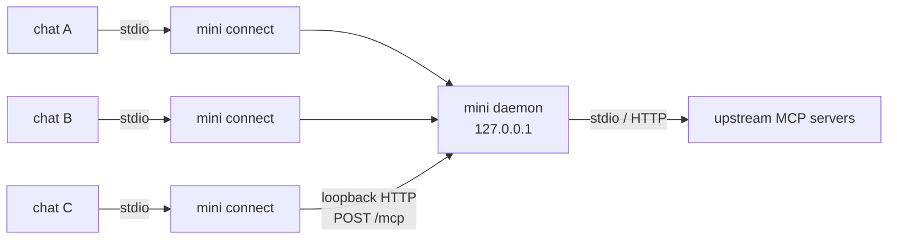

# The mini daemon

## Why a daemon exists

mini works fine with no daemon at all: each chat runs its own `mini connect` process that talks to
upstream MCP servers directly. The daemon is an optimization that two problems make worthwhile
once you have more than one chat open:

- **Shared connections and warm state.** Without it, every chat re-dials every upstream and
  re-runs the MCP handshake on its own. The daemon dials each upstream once and lets all chats
  share it.
- **One process holds credentials.** The daemon injects each upstream's OAuth tokens / API keys
  at startup and spends them on behalf of connected chats, so no individual chat process ever
  touches a credential.

**You never start the daemon yourself.** The first chat that needs it spawns it on demand, and it
keeps running for later chats. You *can* run `mini daemon` by hand (e.g. to pin a port or read
logs), but the zero-config path never requires it.

## How it works

From the agent's side nothing changes: it speaks MCP over stdio to `mini connect`, exactly as it
would with no daemon. `mini connect` just forwards each request to the shared daemon over loopback
instead of connecting to upstreams itself.

- Many `mini connect` processes, one daemon. The daemon owns the upstream connections, projections,
  and per-chat sessions; each `mini connect` just relays JSON-RPC over `POST /mcp`.
- The code lives in `internal/proxy` (the proxy side), `internal/server` (the HTTP daemon),
  `internal/daemon` (rendezvous and the spawn lock), and `cmd/mini/daemon.go` (lifecycle).
- **Only the chat path uses the daemon today.** Direct CLI commands like `mini call` and `mini ls`
  currently connect to upstreams themselves and don't go through the daemon — they could be routed
  through it later to share its warm connections, but aren't yet.

## How a chat connects

When `mini connect` starts, it finds or starts the daemon, then forwards requests to it:

1. **Find it.** A `daemon.port` file records where a daemon *might* be. It's only a hint — liveness
   comes from probing `GET /healthz` and seeing a `200`, never from the file existing or from a
   stored PID. `/healthz` reports `{"ok":true,"sessions":N}`.
2. **Or start it.** No healthy daemon → spawn one, under a lock so that a crowd of chats
   reconnecting at the same instant produces a single daemon rather than a pile-up.
3. **Authenticate.** Read the bearer token from disk and send it with every forwarded request.

## Threat model

> **The credo: mini adds no new attack surface.** We don't try to be more secure than the agent
> running mini — that's impossible and pretending otherwise is theater. An MCP client already runs
> with your privileges and can read your files. Our one job is to not open a door that wasn't
> already open. Every decision below follows from that rule, and "does this add net-new risk?" is
> the question we ask of every change.

**Out of scope** — threats that already own the session, so nothing we do here helps:

- **Same-user code.** A process running as you can read `~/.mini`, take the tokens, drive the
  agent, and exfiltrate. The `0600` token can't stop that and doesn't try — ssh-agent and Docker
  make the same assumption about same-user processes.
- **Root / full system compromise.** Same.

**In scope** — the genuinely new surface mini introduces by running a credential-holding listener
on loopback and making outbound fetches:

- **Browser DNS rebinding.** A web page you visit is untrusted code that can reach the loopback
  interface. Without defense it could `POST` to `127.0.0.1/mcp` and spend your upstream
  credentials. This is the marquee localhost threat and the main reason the daemon is locked down.
- **Other local users on a shared host.** Loopback is shared by everyone on the machine, so on a
  multi-user box another account can reach the daemon's port.
- **SSRF.** Because mini fetches outbound, a crafted or attacker-controlled upstream URL could try
  to reach internal services or resolve to a private IP.

**Residual, and documented.** On loopback TCP another local user could squat `daemon_port` in the
brief gap after a daemon dies and harvest the token a reconnecting proxy sends. The `0600` files
limit who can attempt it; moving to a Unix socket would remove port-squatting entirely (see the
last section).

## Security posture

Each defense maps directly to an in-scope threat above:

- **Bearer token → browser rebinding + other local users.** `mini daemon` mints a 32-byte
  `crypto/rand` token and writes it `0600` to `daemon.token` via an atomic temp-file rename. `/mcp`
  requires `Authorization: Bearer <token>`, compared with `crypto/subtle`. A web page can't read
  the file, so it can't forge the header — **the file permissions are the real boundary.**
  `/healthz` stays open (it holds no secret and exists to be polled for liveness).
- **Stable token across restarts → availability.** A respawned daemon reuses the persisted token
  instead of rotating it, so chats already connected survive a daemon respawn rather than breaking
  with `401`. It's reused only if the file is still `0600`; a looser file is treated as
  compromised and re-minted.
- **Loopback-`Host` check → DNS rebinding.** `/mcp` rejects any request whose `Host` isn't a
  loopback identity (`127.0.0.1`, `::1`, `localhost`), so a page that rebinds `evil.com →
  127.0.0.1` is refused even though the TCP connection lands on loopback — the rebound request
  still carries the attacker's `Host`. Skipped only for an explicit `--dangerous-nonloopback-http`
  bind, where the operator has declared all clients trusted.
- **SSRF-safe dialer → SSRF.** Outbound URLs pass `ValidateURL`, then a dialer that re-validates
  the *resolved* IP at connect time (rejecting private / loopback / link-local / NAT64 / etc.) so
  DNS can't rebind a validated hostname to an internal address. The client also refuses redirects,
  so a trusted host can't `3xx` a session token to an internal one.

## Recovery

When the daemon dies — crash, OOM, sleep, kill, upgrade — open chats recover on their next tool
call without anyone restarting anything:

1. **Classify the failure.** Only failures that provably happened *before* the request executed
   are retried: a dial failure (never reached the daemon), `401` (rejected before dispatch), or
   `not initialized` (the session was lost, gated before dispatch). Anything else — including a
   connection reset *after* the bytes were sent — is returned to the agent unretried.
2. **Respawn, single-winner.** The proxy re-resolves the daemon, spawning a replacement if needed.
   A `flock` spawn lock lets one proxy spawn while the rest block and then find it already up. The
   OS socket bind sits underneath as the ultimate guarantee — only one process can bind
   `daemon_port` — so two daemons are impossible even if the lock is skipped; the lock only removes
   the wasted-spawn herd at scale.
3. **Reconnect.** Re-read the token, re-`initialize` the session, retry the original request.
   Bounded attempts with jittered backoff.
4. **One recovery per proxy.** Concurrent in-flight requests share a generation-counted,
   mutex-guarded link, so N requests hitting a dead daemon trigger a single respawn.

### Why we never retry a post-send failure

If the bytes reached the daemon, it may already have run a non-idempotent upstream write like
`create_issue`. Replaying that is worse than surfacing an error, so any uncertain case fails safe
and goes back to the agent. We retry only when we can *prove* the request never ran.

## Port lifecycle

The port is freed the instant the daemon dies, on any signal. The kernel closes a dead process's
descriptors — including the listening socket — as it exits, and a listening socket has no
`TIME_WAIT` (that applies to established connections, on the side that closed first), so
`daemon_port` is available for the respawn immediately, even after `SIGKILL`. Go's `net.Listen`
sets `SO_REUSEADDR`, so the rebind succeeds even if old client connections linger in `TIME_WAIT`.

`SIGTERM` removes `daemon.port`; `SIGKILL` leaves it stale. That's harmless: liveness is the
`/healthz` probe, so a stale file pointing at a dead or recycled port simply fails the probe and
reads as "no daemon." This is exactly why liveness is a health probe and not a PID or
file-existence check.

**Fixed vs ephemeral port.** A fixed `daemon_port` gives a stable rendezvous: a respawn returns on
the same port, a proxy's cached port stays valid, and recovery is fast. `daemon_port: 0`
(OS-assigned) also works — the respawn lands on a new port and the proxy re-reads the file — but
loses that fast path, and single-winner contention only bites with a fixed port (two `:0` racers
bind two different ports). The test suite covers both.

## Single-instance: what we use, what we rejected

The "exactly one daemon" problem is the same one databases and agents have solved for decades. A
stale lock or a double-start corrupts their data, so their failure modes are the most instructive
prior art.

| Approach | Who uses it | Verdict |
|---|---|---|
| **OS socket bind** (one binder wins, the rest get `EADDRINUSE`) | tmux, git-credential-cache, Redis, most single-instance servers | **Primary.** The kernel is the lock and releases it on death — no stale state possible. |
| **`flock` spawn lock** | `apt`/`dpkg` locks, many CLIs | **Added,** to collapse the spawn herd at scale. Advisory, auto-released on process death. |
| **`/healthz` liveness probe** | Kubernetes liveness/readiness, cloud load balancers | **Used** for rendezvous. Beats `kill(pid,0)` — it confirms the service actually answers, defeating PID reuse. |
| **PID file** | PostgreSQL (`postmaster.pid`), MongoDB (`mongod.lock`), nginx, sshd | **Rejected.** The classic stale-lock / PID-reuse failure: a manual `rm` after a crash, a recycled PID matching an unrelated process, broken on Windows. If used at all, it's debug metadata *behind* a real lock — never the lock itself. |
| **OS supervision** | systemd, launchd, Windows services, runit | **Right for managed/server deployments** where the OS owns the lifecycle — not the zero-config default we want. |
| **Unix socket** | ssh-agent, Docker (`docker.sock`), gpg-agent, MySQL | **Future.** Removes the TCP port (and port-squatting), makes the socket path the lock, and replaces the token with filesystem permissions + peer credentials. |

References: [tmux(1)](https://man7.org/linux/man-pages/man1/tmux.1.html),
[git-credential-cache--daemon](https://git-scm.com/docs/git-credential-cache--daemon),
[flock(2)](https://man7.org/linux/man-pages/man2/flock.2.html),
[PostgreSQL postmaster.pid](https://www.crunchydata.com/blog/postgres-postmaster-file-explained),
[RFC 8252](https://www.rfc-editor.org/rfc/rfc8252.html),
[localhost CORS & DNS rebinding](https://github.blog/security/application-security/localhost-dangers-cors-and-dns-rebinding/).
