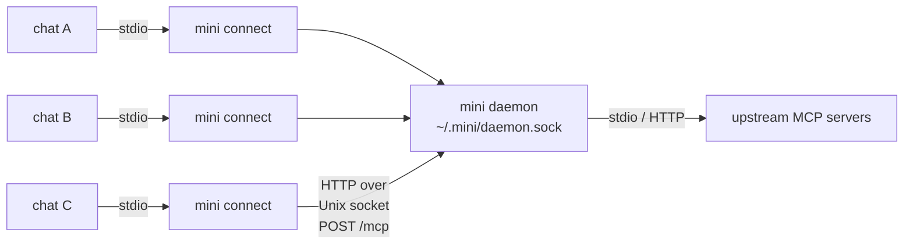

# The mini daemon

## Why a daemon exists

mini works fine with no daemon at all: each chat runs its own `mini connect` process that talks to
upstream MCP servers directly. The daemon is an optimization that two problems make worthwhile
once you have more than one chat open:

- **Shared connections and warm state.** Without it, every chat re-dials every upstream and
  re-runs the MCP handshake on its own. The daemon dials each upstream once and lets all chats
  share it.
- **One process holds credentials.** The daemon injects each upstream's OAuth tokens / API keys
  at startup and spends them on behalf of connected chats, so no individual chat process ever
  touches a credential.

**You never start the daemon yourself.** The first chat that needs it spawns it on demand, and it
keeps running for later chats. You *can* run `mini daemon` by hand (e.g. to read logs), but the
zero-config path never requires it.

## How it works

From the agent's side nothing changes: it speaks MCP over stdio to `mini connect`, exactly as it
would with no daemon. `mini connect` just forwards each request to the shared daemon over a Unix
domain socket instead of connecting to upstreams itself.

- Many `mini connect` processes, one daemon. The daemon owns the upstream connections, projections,
  and per-chat sessions; each `mini connect` just relays JSON-RPC over `POST /mcp` (HTTP spoken over
  the socket — the request URL host is a placeholder the dialer ignores).
- The code lives in `internal/proxy` (the proxy side), `internal/server` (the HTTP daemon),
  `internal/daemon` (rendezvous and spawn lock), and `cmd/mini/daemon.go` (lifecycle).
- **Only the chat path uses the daemon today.** Direct CLI commands like `mini call` and `mini ls`
  currently connect to upstreams themselves and don't go through the daemon — they could be routed
  through it later to share its warm connections, but aren't yet.

## How a chat connects

When `mini connect` starts, it finds or starts the daemon, then forwards requests to it:

1. **Find it.** The socket path is fixed — `<configDir>/daemon.sock` — so there is no rendezvous
   file to read. Liveness comes from probing `GET /healthz` over the socket and seeing a `200`,
   never from the socket file existing or from a stored PID. `/healthz` reports
   `{"ok":true,"sessions":N}`.
2. **Or start it.** No healthy daemon → spawn one, under a lock so that a crowd of chats
   reconnecting at the same instant produces a single daemon rather than a pile-up.
3. **Authenticate.** Read the bearer token from disk and send it with every forwarded request.

## Threat model

> **The credo: mini adds no new attack surface.** We don't try to be more secure than the agent
> running mini — that's impossible and pretending otherwise is theater. An MCP client already runs
> with your privileges and can read your files. Our one job is to not open a door that wasn't
> already open. Every decision below follows from that rule, and "does this add net-new risk?" is
> the question we ask of every change.

**Out of scope** — threats that already own the session, so nothing we do here helps:

- **Same-user code.** A process running as you can read `~/.mini`, take the tokens, drive the
  agent, and exfiltrate. The `0600` token can't stop that and doesn't try — ssh-agent and Docker
  make the same assumption about same-user processes.
- **Root / full system compromise.** Same.

**In scope** — the genuinely new surface mini introduces by running a credential-holding listener
and making outbound fetches:

- **Browser DNS rebinding.** A web page you visit is untrusted code that can reach loopback network
  services ([CORS & DNS rebinding](https://github.blog/security/application-security/localhost-dangers-cors-and-dns-rebinding/)).
  A browser cannot open an `AF_UNIX` socket, so the daemon's socket is simply unreachable from a
  page; the `Host` check (below) backs this up.
- **Other local users on a shared host.** The socket lives in the per-user-private `configDir`, so
  another local account can neither connect to it nor recreate the path to impersonate the daemon.
  Filesystem permissions are the boundary.
- **SSRF.** Because mini fetches outbound, a crafted or attacker-controlled upstream URL could try
  to reach internal services or resolve to a private IP.

## Security posture

- **Unix socket → browser rebinding + other local users (primary).** The daemon listens on
  `<configDir>/daemon.sock`, not a loopback TCP port. `configDir`'s filesystem permissions are the
  access boundary: no browser can reach an `AF_UNIX` socket, and no other local user can connect to
  or squat one in a private directory. This is what closes the two in-scope local threats.
- **Bearer token (defense-in-depth).** `mini daemon` mints a 32-byte `crypto/rand` token and writes
  it `0600` to `daemon.token` via an atomic temp-file rename. `/mcp` requires
  `Authorization: Bearer <token>`, compared with `crypto/subtle`. The socket already gates access;
  the token is a second layer. `/healthz` stays open (it holds no secret and is polled for liveness).
- **Stable token across restarts → availability.** A respawned daemon reuses the persisted token
  instead of rotating it, so chats already connected survive a daemon respawn rather than breaking
  with `401`. It's reused only if the file is still `0600`; a looser file is treated as
  compromised and re-minted.
- **Loopback-`Host` check (defense-in-depth).** `/mcp` rejects any request whose `Host` isn't a
  loopback identity (`127.0.0.1`, `::1`, `localhost`); proxies send `localhost`. Redundant with the
  socket for the default path, but kept so the `--dangerous-nonloopback-http` TCP path stays guarded.
- **SSRF-safe dialer → SSRF.** Outbound URLs pass `ValidateURL`, then a dialer that re-validates
  the *resolved* IP at connect time (rejecting private / loopback / link-local / NAT64 / etc.) so
  DNS can't rebind a validated hostname to an internal address. The client also refuses redirects,
  so a trusted host can't `3xx` a session token to an internal one.

## Recovery

When the daemon dies — crash, OOM, sleep, kill, upgrade — open chats recover on their next tool
call without anyone restarting anything:

1. **Classify the failure.** Only failures that provably happened *before* the request executed
   are retried: a dial failure (never reached the daemon), `401` (rejected before dispatch), or
   `not initialized` (the session was lost, gated before dispatch). Anything else — including a
   connection reset *after* the bytes were sent — is returned to the agent unretried.
2. **Respawn, single-winner.** The proxy respawns the daemon if needed. A `flock` spawn lock
   serializes the attempt so that concurrent proxies produce a single daemon rather than a herd.
   Binding the socket is the ultimate guarantee — only one process can `net.Listen` on the path —
   so two daemons are impossible even if the lock is skipped; the lock eliminates the wasted-spawn
   herd and the TOCTOU window during slow startup. The socket path is fixed, so recovery never has
   to re-address: a respawned daemon returns on the same path and the proxy's client keeps working.
3. **Reconnect.** Re-read the token, re-`initialize` the session, retry the original request.
   Bounded attempts with jittered backoff.
4. **One recovery per proxy.** Concurrent in-flight requests share a generation-counted,
   mutex-guarded link, so N requests hitting a dead daemon trigger a single respawn.

### Why we never retry a post-send failure

If the bytes reached the daemon, it may already have run a non-idempotent upstream write like
`create_issue`. Replaying that is worse than surfacing an error, so any uncertain case fails safe
and goes back to the agent. We retry only when we can *prove* the request never ran.

## Socket lifecycle

On a clean exit (`SIGTERM`/`SIGINT`) the daemon's `Shutdown` closes the listener, which unlinks the
socket file. A `SIGKILL` skips that, leaving a **stale socket file** on disk. That's harmless:
liveness is the `/healthz` probe, so a stale file with no listener behind it fails the probe and
reads as "no daemon." The next daemon's `bindSocket` finds the stale file (the `net.Listen` fails),
removes it, and rebinds. This is exactly why liveness is a health probe and not a PID or
file-existence check.

**Path length.** A Unix socket path is capped by the kernel (104 bytes on macOS, 108 on Linux), so
`<configDir>/daemon.sock` must stay short. The default `~/.mini` is well within bounds; an unusually
deep `--config` directory is rejected up front with a clear error rather than a cryptic bind
failure (`daemon.CheckSocketPath`).

## Single-instance: what we use, what we rejected

The "exactly one daemon" problem is the same one databases and agents have solved for decades. A
stale lock or a double-start corrupts their data, so their failure modes are the most instructive
prior art.

| Approach | Who uses it | Verdict |
|---|---|---|
| **Unix socket bind** (one binder wins; the path is the lock) | ssh-agent, Docker (`docker.sock`), gpg-agent, [tmux](https://man7.org/linux/man-pages/man1/tmux.1.html), [git-credential-cache](https://git-scm.com/docs/git-credential-cache--daemon) | **Primary.** No TCP port (so nothing to squat), filesystem permissions are the access boundary, and the kernel releases the bind on death — no stale lock. Works on macOS/Linux and Windows (`AF_UNIX`). |
| **[`flock`](https://man7.org/linux/man-pages/man2/flock.2.html) spawn lock** | `apt`/`dpkg` locks, BuildKit, Syncthing, Podman | **Used** to serialize the spawn herd. Advisory, auto-released on process death. Same approach as [`gofrs/flock`](https://github.com/gofrs/flock), hand-rolled to avoid the dependency. |
| **`/healthz` liveness probe** | Kubernetes liveness/readiness, cloud load balancers | **Used** for rendezvous. Beats `kill(pid,0)` — it confirms the service actually answers, defeating PID reuse. |
| **PID file** | [PostgreSQL `postmaster.pid`](https://www.crunchydata.com/blog/postgres-postmaster-file-explained), MongoDB (`mongod.lock`), nginx, sshd | **Rejected.** The classic stale-lock / PID-reuse failure: a manual `rm` after a crash, a recycled PID matching an unrelated process, broken on Windows. If used at all, it's debug metadata *behind* a real lock — never the lock itself. |
| **OS supervision** | systemd, launchd, Windows services, runit | **Right for managed/server deployments** where the OS owns the lifecycle — not the zero-config default we want. |
| **Loopback TCP port** | Redis, Jupyter, Chrome remote debugging | **Rejected.** A shared port any local user can squat and any browser can reach (DNS rebinding); the recurring localhost-security footgun. |
