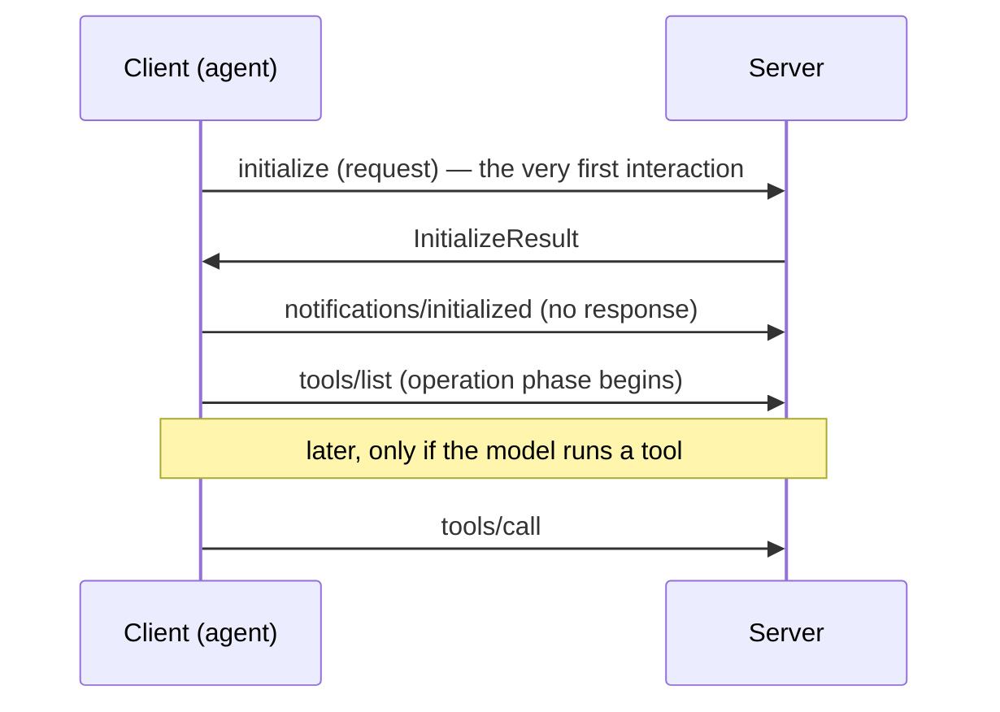
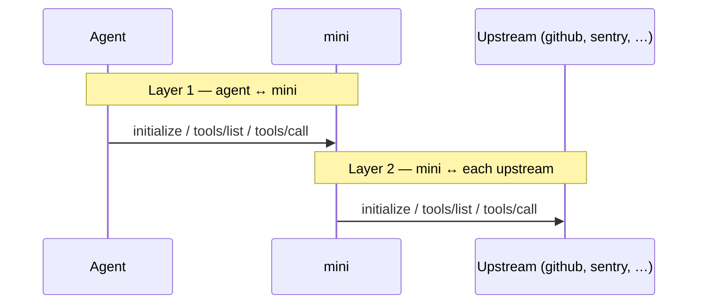

# MCP connection lifecycle, and where mini sits in it

How an MCP client connects to a server, what the spec mandates, how agents behave at a high
level, and how mini — both a server (to the agent) and a client (to upstreams) — fits between
them.

## The spec lifecycle

Source of truth: the MCP specification — prose in
[`lifecycle.mdx`](https://github.com/modelcontextprotocol/modelcontextprotocol/blob/699e664dfe1158045996f28e7dbd80db53bebbeb/docs/specification/2025-11-25/basic/lifecycle.mdx)
and the machine schema
[`schema.ts`](https://github.com/modelcontextprotocol/modelcontextprotocol/blob/699e664dfe1158045996f28e7dbd80db53bebbeb/schema/2025-11-25/schema.ts).
Behavior below is stable across protocol versions 2024-11-05, 2025-03-26, 2025-06-18,
2025-11-25, and draft unless noted; permalinks point at 2025-11-25.

The lifecycle has three phases. Initialization is the one that matters here.

1. **Initialization** —
   [*"MUST be the first interaction between client and server"*](https://github.com/modelcontextprotocol/modelcontextprotocol/blob/699e664dfe1158045996f28e7dbd80db53bebbeb/docs/specification/2025-11-25/basic/lifecycle.mdx#L40).
   The client **MUST** initiate by sending an `initialize` **request** (a JSON-RPC request,
   method `initialize` — not a tool call). The server replies with its capabilities, and the
   client confirms with a `notifications/initialized` notification.
2. **Operation** — `tools/list`, `tools/call`, `resources/*`, etc.
3. **Shutdown** — transport close.

The opening exchange, in order:



`tools/call` is unrelated to `initialize`. The first message on the wire is always the
`initialize` request; tool *calls* come much later, if at all.

### What [`InitializeResult`](https://github.com/modelcontextprotocol/modelcontextprotocol/blob/699e664dfe1158045996f28e7dbd80db53bebbeb/schema/2025-11-25/schema.ts#L281) can carry

```ts
interface InitializeResult extends Result {
  protocolVersion: string;
  capabilities: ServerCapabilities;
  serverInfo: Implementation;
  instructions?: string;   // the only model-facing free text
  _meta?: { [key: string]: unknown };
}
```

- [`instructions`](https://github.com/modelcontextprotocol/modelcontextprotocol/blob/699e664dfe1158045996f28e7dbd80db53bebbeb/schema/2025-11-25/schema.ts#L294)
  is the only channel the spec routes *to the model* — *"thought of like a 'hint' to the
  model… MAY be added to the system prompt."* Sent once, at handshake.
- There is **no dedicated warnings/issues field**. A JSON-RPC
  [`error` on `initialize`](https://github.com/modelcontextprotocol/modelcontextprotocol/blob/699e664dfe1158045996f28e7dbd80db53bebbeb/docs/specification/2025-11-25/basic/lifecycle.mdx#L263)
  is for hard failure only (protocol-version mismatch, failed capability negotiation, timeout)
  and **fails the whole connection** — not a soft "one thing is degraded" signal.
- [`_meta`](https://github.com/modelcontextprotocol/modelcontextprotocol/blob/699e664dfe1158045996f28e7dbd80db53bebbeb/schema/2025-11-25/schema.ts#L93)
  is free-form but clients ignore unknown keys; not model-facing.

### What [`InitializeRequestParams`](https://github.com/modelcontextprotocol/modelcontextprotocol/blob/699e664dfe1158045996f28e7dbd80db53bebbeb/schema/2025-11-25/schema.ts#L257) carries (and does not)

```ts
interface InitializeRequestParams { protocolVersion; capabilities; clientInfo; }
```

No timeout/deadline field, in any version. **The client's connect timeout is private and
invisible to the server.** A server cannot read it and must not depend on its value.

### [Timeouts](https://github.com/modelcontextprotocol/modelcontextprotocol/blob/699e664dfe1158045996f28e7dbd80db53bebbeb/docs/specification/2025-11-25/basic/lifecycle.mdx#L246) and [ping](https://github.com/modelcontextprotocol/modelcontextprotocol/blob/699e664dfe1158045996f28e7dbd80db53bebbeb/docs/specification/2025-11-25/basic/utilities/ping.mdx) (spec guidance)

- §Timeouts: implementations **SHOULD** establish timeouts on all sent requests and **SHOULD**
  always enforce a maximum, to prevent hung connections and resource exhaustion.
- §Ping: an **optional** `ping` request/response (either party may send it). The spec says
  implementations
  [**SHOULD** periodically ping](https://github.com/modelcontextprotocol/modelcontextprotocol/blob/699e664dfe1158045996f28e7dbd80db53bebbeb/docs/specification/2025-11-25/basic/utilities/ping.mdx#L57)
  to detect connection health, frequency configurable. It is all SHOULD/MAY — nothing is MUST.

## How agents connect (high level)

Coding agents that consume MCP — Codex (open source) and Claude Code among them — follow the
same broad shape at startup, and it informs how mini should behave:

- **Each server is connected independently and in parallel** (with some bound on how many at
  once), each running its own `initialize` → `tools/list` handshake. One slow or dead server
  does not block the others.
- **Each connection is time-boxed** with a per-server connect timeout on the order of tens of
  seconds, and a failed or timed-out server is **isolated**: it's marked unavailable and
  startup continues. A single bad server does not sink the session.
- **Neither pings to check liveness.** A dead server is detected *reactively* — when its
  transport drops or a later call fails — not by a periodic health check.
- **Failures surface to the user, not the model.** Dead-server state shows up in the client's
  UI; the agent/model just sees the affected tools quietly disappear, or gets an error when it
  calls a tool on a server that has gone away.

Codex is open source; its specifics are documented with permalinks in
[codex-mcp-loading.md](codex-mcp-loading.md). For other agents, treat the four behaviors above
as the contract mini should be compatible with.

The two takeaways that drive mini's design:

1. Agents treat each upstream connection as **independent, time-boxed, and non-fatal**.
2. Agents do **not** tell the model when a server dies — tools just vanish or fail on call.

## Where mini fits: two layers, two `initialize`s

mini is a proxy, so it sits in the middle of **two** independent lifecycles. Each is a full,
separate handshake — easy to conflate, but different messages on different connections.



- **Layer 1 — agent ↔ mini.** The agent is the client; mini is the server. The agent's first
  interaction is a Layer-1 `initialize` request to mini.
- **Layer 2 — mini ↔ upstreams.** mini is the client; github/sentry/etc. are the servers. mini
  sends its own Layer-2 `initialize` + `tools/list` to each upstream and re-exposes the
  resulting tools through Layer 1.

### Connection modes

- **Standalone** (`mini connect --standalone`, or `--http`): the agent spawns mini directly; mini
  serves Layer 1 over stdio (and optionally HTTP).
- **Daemon** (default): the agent spawns a thin `mini` **proxy**, which connects to a shared,
  long-lived **daemon** over HTTP. The proxy bridges agent stdio ↔ daemon HTTP and *forwards*
  the Layer-1 `initialize` to the daemon. Because the daemon is long-lived, the agent typically
  connects to an already-warm daemon whose upstreams are loaded, so its handshake is answered
  immediately.

### Connecting upstreams

At startup mini connects each configured upstream
([`buildAndConnectServer`](https://github.com/mcpmini/mini/blob/ded9bcec0b6eec00e25282e09f8e4c8235907391/cmd/mini/main.go#L239)) —
a Layer-2 handshake per upstream — and exposes their tools through Layer 1. In daemon mode those
connections live in the
[daemon](https://github.com/mcpmini/mini/blob/ded9bcec0b6eec00e25282e09f8e4c8235907391/cmd/mini/daemon.go#L36),
so a single set of upstream connections is shared across every agent that attaches.

### Design direction

mini should give the agent the same per-upstream isolation agents already expect, and — because
it sits in the middle — surface upstream health to the *model*, which the agents do not:

- **Serve the agent's Layer-1 handshake independently of upstream connection.** Answer
  `initialize` with zero upstreams required, connect Layer 2 in the background (in parallel,
  each time-boxed), and announce tools as they arrive via `notifications/tools/list_changed`
  (capability already advertised).
- **A per-upstream connect timeout** bounds when a server is marked degraded, so one slow
  upstream never blocks the others.
- **Surface degraded upstreams to the model** via the Layer-1 handshake `instructions` (the one
  model-facing channel that works in proxy mode) and `config{action:"status"}`, with re-auth
  hints (`mini auth <server>`).

Connection-robustness and degraded-upstream reporting are tracked in
[issue #33](https://github.com/mcpmini/mini/issues/33).
